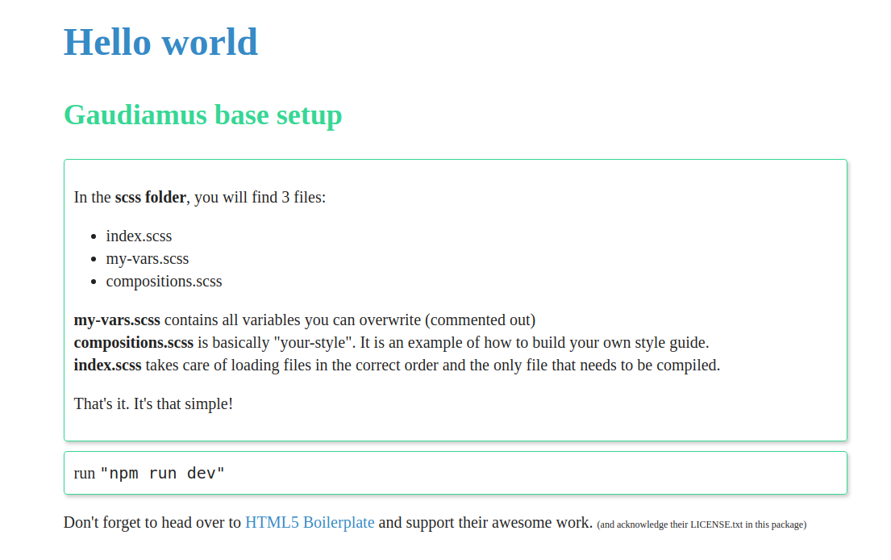

# Gaudiamus css starter

## CSS builder

This repo is a development-tool for people who want a zero setup "develop my CSS" solution
which outputs a single CSS file. With the customizable nature of Gaudiamus there are several
setups possible. However, this starter kit enables a quick and painless approach.

## Installation

1. clone or fork

    `git clone https://github.com/gaudiamus-css/gaudiamus-starter.git`
2. install dependencies

    `npm install`
3. run developing mode

    `npm start`

## Documentation

The Gaudiamus implementation should be pretty self-explanatory when looking at the folder ***/scss***.
To learn more about Gaudiamus CSS, visit [gaudiamus-css.github.io](https://gaudiamus-css.github.io/).

In general, the development approach is

- install packages (`npm install`)
- run dev server (`npm start`)
- change files in **/scss**
- test in browser playground ( usually http://localhost:5000 )
- when done/happy, use **my-css.css** in whatever project you like.

## Build something beautiful

You built a template that screams "share me"? Be sure to create an issue on this repo reporting the location:
we'd love to promote your creation. 

I guess you know what a permissive license is, but beyond that: 
We thank you for mentioning us when using our tools.

