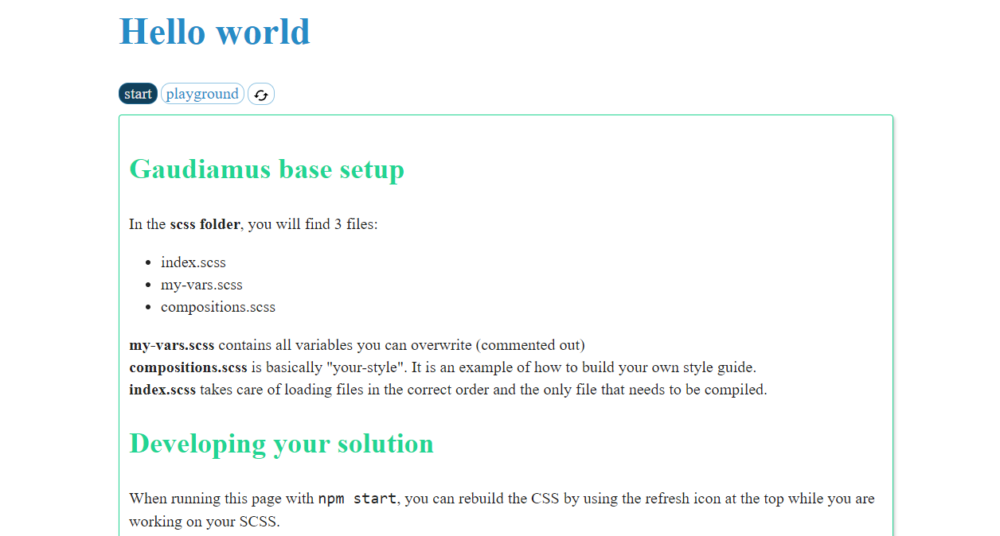

# Gaudiamus css starter

## Installation

1. clone or fork

    `git clone https://github.com/gaudiamus-css/gaudiamus-starter.git`
2. install dependencies

    `npm install`
3. run parcel

    `npm run dev`

## Documentation

The Gaudiamus implementation should be pretty self-explanatory when looking at the folder ***/scss***.
To learn more about Gaudiamus CSS, visit [gaudiamus-css.github.io](https://gaudiamus-css.github.io/).

## Build something beautiful

You built a template that screams "share me"? Be sure to create an issue on this repo reporting the location:
we'd love to promote your creation.

### About HTML5 Boilerplate

I am not in any way associated with HTML5 Boilerplate. Like millions of other developers,
I use it for pure HTML projects. Check them out at [HTML5 Boilerplate](https://html5boilerplate.com/)
